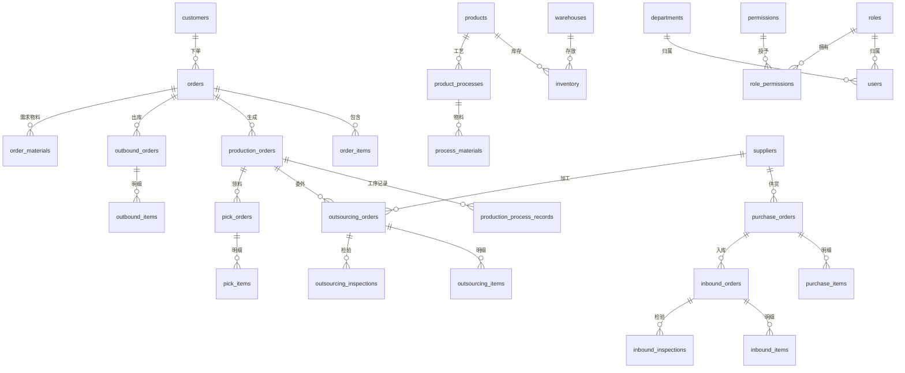

# 铭晟 ERP-MES 管理系统

> 面向中小型制造企业的一体化 ERP + MES 管理平台 · **v1.9.4**

## 技术栈

| 层级 | 技术 |
|---|---|
| 前端 | React 18 + Vite + Tailwind CSS + React Router |
| 后端 | Node.js + Express + Helmet |
| 数据库 | PostgreSQL (pg) |
| 图表 | Recharts |
| 认证 | JWT 双 Token（HttpOnly Cookie） |
| 校验 | Zod Schema |
| 测试 | Vitest（131 用例） |
| CI/CD | GitHub Actions |
| 文档 | Swagger UI（/api-docs） |

## 功能模块

- **仪表盘** — 经营数据可视化、趋势图表、库存预警
- **订单管理** — 销售订单 CRUD、自动生成生产工单
- **生产管理** — 生产工单、排程甘特图、工序报工、领料管理
- **仓库管理** — 入库/出库调度、库存台账、批次追踪、仓库盘点、仓库间调拨
- **质量检验** — 来料/巡检/委外/成品四类检验
- **采购管理** — 采购单据、供应商管理、智能采购建议
- **委外加工** — 委外工单、自动入库联动
- **财务管理** — 应收/应付账款、收付款记录
- **基础数据** — 产品档案、供应商/客户/部门管理、材质分类（树形）
- **系统管理** — 角色权限、用户管理、数据备份与恢复、操作日志、打印模板引擎
- **扫码工站** — 条码扫描快速跳转
- **车间大屏** — 生产状态全景监控
- **数据大屏** — Recharts 多维图表分析
- **AI 智能助手** — 全局悬浮 AI 助理，支持自然语言查库（Text-to-SQL）、语音输入、图片识别、企微群通知联动

## 快速启动

```bash
# 安装依赖
cd backend && npm install
cd ../frontend && npm install

# 启动后端 (默认 3198 端口)
cd backend && node server.js

# 启动前端开发服务
cd frontend && npm run dev

# 生产构建
cd frontend && npm run build

# 运行测试
cd backend && npm test

# 代码检查
cd backend && npm run lint

# API 文档
# 启动后端后访问 http://localhost:3198/api-docs
```

## 环境变量

| 变量 | 说明 | 默认值 |
|---|---|---|
| `PORT` | 后端端口 | `3198` |
| `JWT_SECRET` | JWT 签名密钥 | 内置默认值（⚠️ 生产环境务必修改） |
| `JWT_REFRESH_SECRET` | Refresh Token 密钥 | 自动派生 |
| `JWT_EXPIRES_IN` | Access Token 有效期 | `2h` |

## 项目结构

```
erp-mes-system/
├── frontend/
│   └── src/
│       ├── components/     # 通用组件 (Table, Modal, ProcessConfigPanel...)
│       ├── pages/          # 页面模块 (Dashboard, Sidebar, *Pages...)
│       ├── context/        # React Context (Auth, Toast)
│       ├── hooks/          # 自定义 Hook (useDraftForm)
│       ├── store/          # Zustand 状态管理 (useAuthStore)
│       └── api/            # API 请求层（含缓存 + credentials）
├── backend/
│   ├── server.js           # Express 入口
│   ├── database.js         # PostgreSQL 初始化 & DDL
│   ├── config/             # jwt.js, security.js, swagger.js
│   ├── middleware/         # permission.js, validate.js, pagination.js
│   ├── validators/         # Zod Schema (schemas.js)
│   ├── routes/             # 23 个业务路由模块
│   ├── tests/              # Vitest 测试用例 (131 个)
│   └── utils/              # order-number, unit-convert
├── .github/workflows/      # GitHub Actions CI
├── .prettierrc             # 代码格式化配置
└── README.md
```

## 默认账号

| 账号 | 密码 | 角色 |
|---|---|---|
| `admin` | `admin123` | 管理员 |
| `user` | `123456` | 普通用户 |

## v1.9.4 AI 智能助手 & 安全加固（2026-05-06）

### 🤖 AI 智能助手系统
- **全局悬浮助理** — 系统右下角常驻 AI 聊天气泡，支持文本/语音/图片多模态交互
- **Text-to-SQL 自然语言查库** — 内部员工可用自然语言查询 ERP 数据，AI 自动生成 SQL 并在只读事务沙箱中安全执行
- **角色权限隔离** — 外部客户/供应商通过 System Prompt 硬性封锁数据库访问能力，保障商业机密
- **多模型配置中心** — 管理后台支持 CRUD 管理多套大模型配置（DeepSeek/GPT-4o 等），一键切换全系统 AI 引擎
- **企微群机器人联动** — AI 可根据用户意图自动向企业微信群推送报警/求助信息
- **多轮工具调用** — while 循环自动处理大模型的连续 Function Calling，支持复杂的多步推理查询

### 🔒 安全加固（代码审查 3 轮迭代，10 项修复）
- **致命修复** — 只读事务沙箱从离散 `BEGIN/ROLLBACK` 重构为 `req.db.transaction()` + 强制异常回滚，彻底堵死连接池泄漏
- **致命修复** — while 循环增加 `MAX_TOOL_ROUNDS = 5` 安全阀，防止大模型异常无限循环烧光 API 额度
- **致命修复** — API Key 零泄露，GET 列表接口不再返回密钥明文
- **高危修复** — `/chat` 接口增加用户登录校验
- **高危修复** — `JSON.parse(toolCall.arguments)` 增加 try-catch 容错
- **高危修复** — CRUD 接口增加必填字段校验，禁止空配置入库
- **高危修复** — 禁止删除当前活跃的 AI 模型配置
- **中危修复** — 编辑配置时 API Key 留空则保留原密钥，防止脱敏值覆盖真实密钥

### 🐛 Bug 修复
- **WorkstationQRPage** — 修复 `api.delete` → `api.del` 方法名错误导致工位删除功能崩溃
- **AI 多轮调用卡死** — 重构后端工具执行流为 while 循环，解决首次 tool_call 后前端无响应的问题

## v1.9.1 安全架构升级 & 性能优化 & 表单重构（2026-04-15）

### 🔒 安全架构升级（HttpOnly Cookie 鉴权）
- **彻底消除 XSS 令牌窃取风险** — JWT 从 LocalStorage 迁移至 HttpOnly Cookie，前端 JavaScript 完全无法读取
- **后端 Cookie 签发** — 安装 `cookie-parser`，登录/刷新接口通过 `res.cookie()` 下发 `token`（12h）和 `refreshToken`（7d，路径限定 `/api/users/refresh`）
- **前端鉴权净化** — `api/index.js` 移除手动 `Authorization` 头拼接，全局启用 `credentials: 'include'`
- **AuthStore 重构** — `useAuthStore` 彻底清除敏感令牌持久化，仅保留基础用户展示信息
- **安全同步机制** — 新增 `/api/users/me/permissions` 接口 + `fetchSelf()` 钩子，页面加载时实时拉取权限树
- **Logout 白名单** — `/api/users/logout` 加入免鉴权白名单，确保过期会话也能通知后端清除 Cookie
- **ImportPage 修复** — 消除唯一绕过 Cookie 直接使用旧 `Authorization` 头的漏洞页面

### ⚡ 全站性能提速（Promise.all 并行化）
- **WarehousePages** — 仓库管理初始化请求并行化
- **PurchasePages** — 采购管理初始化请求并行化
- **OutsourcingPages** — 委外管理初始化请求并行化
- **UserPages** — 用户管理初始化请求并行化
- **ProductionPages** — `allMaterials` 包裹 `useMemo` 修复缓存失效

### 📝 表单组件重构（React Hook Form + Zod）
- **PickFormModal** — 全新领料/退料表单组件，集成 `react-hook-form` + `zod` 校验 + PDA 扫码枪 `appendRow` 接口
- **ProductionPages 瘦身** — 复杂领料逻辑从 `PickMaterialManager` 剥离到独立组件
- **PurchaseFormModal 文案修正** — "预估合资" → "预估合计"

### 🛡️ 代码审查（第 36-37 轮，共 8 项修复）
- **致命修复** — `PrintableQRCode` 组件声明被截断导致构建失败
- **致命修复** — `useScanner` 默认导入不存在，改为命名导入
- **高危修复** — `ImportPage` 完全绕过 HttpOnly Cookie 鉴权
- **高危修复** — `App.jsx` 残留废弃 `AUTH_KEY` 常量
- **中危修复** — `PickFormModal` 未使用的 `watch` 变量引发多余重渲染
- **中危修复** — `allMaterials` 未被 `useMemo` 包裹导致 Map 缓存永久失效

## v1.9.0 订单全链路自动化 & 深度代码审查（2026-04-02）

### 🔄 订单生命周期全链路自动化
- **取消手动「完成订单」** — 前端删除手动完成按钮，改为系统自动驱动
- **生产完成 → 订单自动完成** — 所有工单完成后自动标记订单 `completed` 并创建成品出库单
- **出库确认 → 自动发货** — 出库审批完成后自动更新订单为 `shipped` 并生成应收账款
- **状态管理加固** — 移除 `completed`/`shipped` 的手动设置权限，防止人工误操作

### 🛡️ 深度代码审查（第9-11轮，共 10 项修复）
- **致命Bug修复** — 修复 `for` 循环中 `return` 导致事务中断、函数闭合括号缺失
- **业务链路修复** — 委外完成不触发出库单、手动标工单完成不联动订单进度
- **安全加固** — 入库/出库编辑接口增加状态校验（禁止修改已完成单据）
- **数据一致性** — 财务汇总查询增加筛选条件同步
- **日志模块防崩溃** — `/filters` 路由补全 `try-catch`
- **死代码清理** — 移除 `orders.js` 中无用的 `createReceivable` 引入

### 🤖 钉钉群机器人集成
- 支持 Outgoing 回调模式查询订单/库存/生产状态
- 输出完整使用教程文档

## v1.8.1 常规体验优化与Bug修复

### 更新细节
- 进行例行维护与性能调优

## v1.8.0 重大更新（2026-03-30）

### 自定义打印模板引擎
- 🖨️ **HTML 模板引擎** — 支持 `{{变量}}` 占位符 + `<!-- LOOP_*_START/END -->` 循环块
- 📝 **模板编辑器** — 代码编辑 + 实时预览，未匹配字段红色标记
- 🔌 **数据适配层** — `normalizeData` 自动映射 API 字段到模板占位符
- 🛡️ **XSS 防护** — sandbox iframe 隔离渲染
- 📄 **模板 CRUD API** — 统一 `{success: true}` 响应格式

### 权限体系全面优化
- 🔒 **敏感 API 加固** — `GET /roles`、`/permissions`、`/users` 等 4 个查询接口加管理员权限
- 🧹 **权限码清理** — 清除不存在的 `system_admin` 权限码，改用本地 `requireAdmin`
- 🖥️ **工位展示屏免鉴权** — screen GET 路由加入 JWT 白名单（仅 GET 免鉴权，POST 仍需 Token）
- 🔄 **权限自动分配** — 迁移补丁新增权限后自动给 admin 角色分配
- 📋 **前端权限映射补全** — `workshop-monitor` 菜单加入 `dashboard_view` 权限控制

### 代码质量（第六轮审查，14 项修复）
- 打印引擎 API 响应统一化、路由优先级修复、事务安全修复
- 出库单/生产工单 LEFT JOIN 补全关联数据
- 模板删除功能、预览渲染逻辑修复、数据库事务返回值处理）。
- **网络修复**：移除 CSP 的 upgrade-insecure-requests 和 HSTS 配置，解决内网 HTTP 直连被强制 HTTPS 导致无法访问的问题。
- **系统优化**：统一规范 .ps1 脚本为 UTF-8 BOM 编码格式，解决控制台中文乱码问题。

## v1.7.0 更新（2026-03-29）

### 更新细节
- 1. 上线独立财务模块（应收应付记账） 2. 增强安全防护与清理遗留脚本 3. 智能仓储盘点增强（无库存档案盘盈手工补录挂载）

## v1.6.1 全局修复 & 网络直连支持

### 更新细节
- **业务修复**：全局业务逻辑严谨性审查优化（领料单位换算、调拨事务、状态白名单校验、缓存清理联动、数据库事务返回值处理）。
- **网络修复**：移除 CSP 的 upgrade-insecure-requests 和 HSTS 配置，解决内网 HTTP 直连被强制 HTTPS 导致无法访问的问题。
- **系统优化**：统一规范 .ps1 脚本为 UTF-8 BOM 编码格式，解决控制台中文乱码问题。

## v1.6.0 生产库存联动 & 下拉优化

### 产品命名与公差
- 产品名称/规格由尺寸实时生成，支持非对称公差（+3-1），空值自动补0
- 外径/内径/壁厚专属符号前缀，壁厚/内径一键切换

### 下拉选择框
- 所有产品/物料下拉显示 `[供应商名]` 或 `[客户名]` 前缀
- 原材料/半成品/成品 `<optgroup>` 分组，全系统7处统一
- 领料物料按成品绑定关系过滤

### 生产库存联动
- 半成品单位换算修复（搜索范围扩至 allMaterials）
- 报工成功自动 toast 入库提示
- load() 统一 `await Promise.all()` 并行加载
- 产品删除级联清理 `product_bound_materials`

### 代码质量
- 移除冗余 state，物料过滤改为 `useMemo` 缓存
- 成品列表新增"公差"列和"绑定物料"列

## v1.5.0 新特性

### 安全增强
- 🔐 **双 Token 认证** — access token 2h + refresh token 30d，独立密钥签发
- 🛡️ **Helmet 安全头** — 防 XSS、点击劫持、MIME 嗅探
- ✅ **Zod Schema 校验** — 8 个 Schema 覆盖全部创建接口
- 🚦 **状态白名单** — 6 个模块防止非法状态转换

### 性能优化
- ⚡ **Table 虚拟滚动** — 超过 100 行自动启用，仅渲染可视区
- 📦 **请求缓存层** — GET 请求 30s TTL 缓存，写操作自动清除
- 🔍 **SQL 优化** — 委外 N+1 查询改为批量 SQL + 搜索索引

### 工程化
- 🧪 **48 个测试用例** — Vitest 覆盖工具函数、业务逻辑、集成流程
- 📚 **Swagger API 文档** — 访问 `/api-docs`
- 🔄 **GitHub Actions CI** — 推送自动运行 lint → test → build
- 🗺️ **React Router** — 30 个 URL 路由，支持浏览器前进后退

### v1.5.4 安全加固与代码重构
- 🔒 **Dashboard 权限补全** — 4 个仪表盘路由添加 `requirePermission('dashboard_view')`
- 🛡️ **Backup 路径注入修复** — `backupPath` 参数增加 `path.resolve()` + 穿越检测
- ♻️ **outsourcing.js 拆分** — PUT /:id/status 107 行 God Function → 4 个独立辅助函数
- 🎨 **confirm() → ConfirmModal** — 10 个文件 29 处原生 `confirm()` 替换为统一样式 `useConfirm` Hook
- 🗄️ **权限迁移机制** — `ensurePermissionExists()` 确保新增权限自动补充到现有数据库

### v1.5.3 代码审查与部署自动化
- 🧹 **全系统 import 清理** — 12 个页面共清理 93 个未使用 import
- ⚡ **load() 拆分优化** — PurchasePages/OrderPages/OutsourcingPages/BasicDataPages 初始化数据与动态刷新分离，减少重复请求
- 🔧 **API 路径修复** — `/processes` → `/production/processes`，修复委外/生产/质检页面 API 异常
- 🛡️ **错误守卫** — openView/openEdit 添加 API 异常捕获，防止白屏
- 🌐 **CORS 多域名** — 支持 `suncraft.site` 和 `msgy.asia` 双域名访问
- 📦 **Patch 依赖更新** — react-router-dom/recharts/vite/vitest 更新至最新 patch
- 🚀 **一键部署脚本** — `deploy/deploy.ps1` 支持 Windows→Windows 自动同步（构建→打包→上传→重启）
- 📄 **部署文档更新** — 新增远程服务器部署、PM2 管理、数据库备份恢复指南

### v1.5.2 代码质量优化
- 🧩 **ProcessConfigPanel 组件抽取** — 三处工序配置 UI 统一为共享组件，减少 260+ 行代码
- 🔒 **CSP 安全策略** — 从 `contentSecurityPolicy: false` 改为合理的指令配置
- 🛡️ **产品编码唯一性校验** — POST 创建时前置检查，防止重复编码
- ⚡ **buildTree O(n) 优化** — 材质分类树构建从 O(n²) 递归改为 HashMap 单次遍历
- 🔧 **竞态修复** — 原材料/半成品加载改为 `Promise.all` 消除状态覆盖
- 📦 **版本号自动注入** — Vite 构建时从 `package.json` 注入，"关于系统"页面自动同步

## 数据库关系图



## 许可证

内部系统，仅限授权使用。
