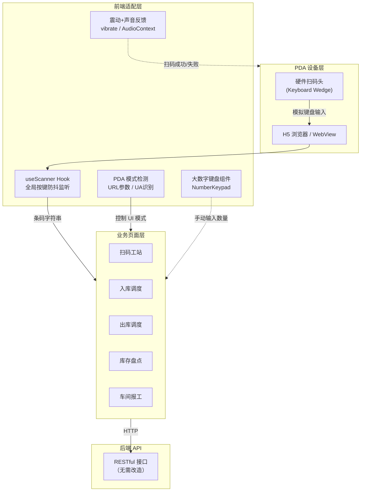
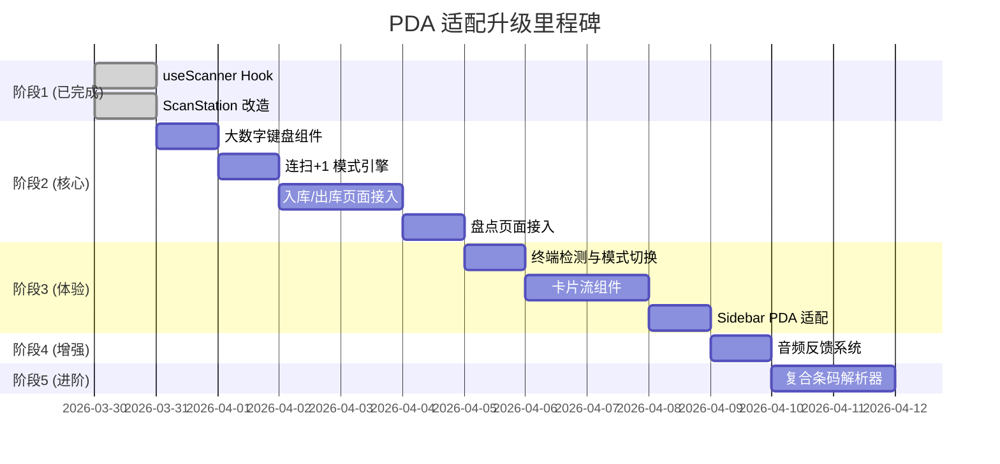

# 铭晟 ERP-MES 系统 · PDA 扫码深度适配升级计划

> 版本目标：v2.0（PDA 工业级适配）  
> 基线版本：v1.8.0  
> 编制日期：2026-03-31

---

## 一、项目背景

PDA 设备商已确认支持 H5 浏览器/WebView，系统无需开发原生安卓 APP。PDA 硬件扫码头工作在**键盘模拟模式（Keyboard Wedge）**，扫码后自动以极快速度（每字符 < 30ms）模拟键盘输入条码字符串，并在末尾附加 `Enter` 回车键。

**当前已完成（v1.8.0-patch）**：
- ✅ 创建 `useScanner` 全局无焦点防抖扫码钩子
- ✅ 改造扫码工站页面，移除 `<input autoFocus>` 防止 PDA 弹出软键盘
- ✅ 接入 `navigator.vibrate()` 震动反馈

---

## 二、总体架构



---

## 三、升级阶段规划

### 阶段 1：基础设施层（已完成 ✅）

| 任务 | 状态 | 说明 |
|:---|:---:|:---|
| `useScanner` Hook | ✅ | 全局 `keydown` 捕获，50ms 防抖，自动过滤人工慢速键入 |
| 扫码工站改造 | ✅ | 移除 Input 焦点依赖，改为"等待硬件扫码"虚拟面板 |
| 震动反馈 | ✅ | `navigator.vibrate([100])` 短震确认 |

---

### 阶段 2：扫码交互双模式引擎

> **本阶段核心目标**：放弃伪需求，专注于不锈钢管行业的“称重输入”与“多维码解析”，让出入库具备工业级流畅度

#### 2.1 扫码弹出大数字键盘模式（Scan & Input）—— 当前最高优先级

**适用场景**：整捆/整托盘入库、称重物料录入（如 135.5 kg 钢管）

```
操作流程：
┌─────────────────────────────────────────────┐
│  库管员扫描钢管捆上的流转标签                 │
│                                              │
│  扫码 → "滴" → 屏幕变暗，弹出大数字键盘       │
│                                              │
│  ┌───────────────────────────────────┐       │
│  │     无缝钢管 φ89×8                │       │
│  │     请输入实际称重 (kg)            │       │
│  │                                   │       │
│  │     ┌─────────────────────┐       │       │
│  │     │      135.5          │       │       │
│  │     └─────────────────────┘       │       │
│  │                                   │       │
│  │   ┌───┐ ┌───┐ ┌───┐              │       │
│  │   │ 7 │ │ 8 │ │ 9 │              │       │
│  │   ├───┤ ├───┤ ├───┤              │       │
│  │   │ 4 │ │ 5 │ │ 6 │              │       │
│  │   ├───┤ ├───┤ ├───┤              │       │
│  │   │ 1 │ │ 2 │ │ 3 │              │       │
│  │   ├───┤ ├───┤ ├───┤              │       │
│  │   │ . │ │ 0 │ │ ⌫ │              │       │
│  │   └───┘ └───┘ └───┘              │       │
│  │                                   │       │
│  │   ┌───────────────────────┐       │       │
│  │   │      ✓ 确 认          │       │       │
│  │   └───────────────────────┘       │       │
│  └───────────────────────────────────┘       │
│                                              │
│  每个按钮最小 60×60px，粗底劳保手套精准点击   │
└─────────────────────────────────────────────┘
```

**技术实现**：
- 新建 `NumberKeypad.jsx` 全屏遮罩层组件
- 按钮最小触摸区域 60×60px（工业级标准，适配带手套操作）
- 必须原生支持**小数点**输入（匹配钢管重量结算特性）
- 确认后自动关闭键盘，将重量/数量写入对应明细行
- 支持连续扫码：确认后立刻回到"等待扫码"状态

#### 2.2 复合条码智能一扫通（Scan & Auto-fill）—— 终极目标

**适用场景**：带有标准装箱单/流转卡的整捆不锈钢管出入库

**业务逻辑**：
不再单纯只将条码映射为唯一的 `product_id`。如果车间的标签是系统打印的二维码，包含类似 `Product: P001, Batch: B001, Weight: 350.5kg` 的复杂字符串。
1. 扫码。
2. 前端静默解析器 `barcodeParser.js` 瞬间拆解字符串。
3. 界面上同一行的数据框瞬间填满：产品规格、批次号、重量，无需人工再调出键盘输入。
4. 极大提升发配货速度。

~~#### 2.3 废弃特性：连扫 +1 模式~~
*说明：经过业务调研，不锈钢管为重卡物资，以重量和批量支数为清点单位，完全不适用五金快销行业的快频连扫加一动作，已将其从开发计划中永久移除。*

---

### 阶段 3：PDA 专属 UI 自适应

#### 3.1 智能终端检测

```javascript
// 检测逻辑优先级
1. URL 参数：?device=pda     → 强制 PDA 模式
2. localStorage 记忆         → 用户上次选择的模式
3. User-Agent 检测           → 包含 Android 且屏幕宽度 < 768px
```

#### 3.2 PDA 模式下的 UI 精简

| 元素 | PC 模式 | PDA 模式 |
|:---|:---|:---|
| 左侧边栏 | 完整展示（260px） | **完全隐藏**，改为底部 Tab |
| 顶部通知栏 | 通知铃铛 + 用户名 | **隐藏** |
| 页面标题 | 完整 | 精简为一行 |
| 表格 | 多列横向滚动 | **降级为卡片流** |
| 按钮高度 | 32-36px | **最小 44px** |
| 字体大小 | 14px | **最小 16px** |

#### 3.3 表格 → 卡片流降级

**PC 端表格形态**：
```
┌───────┬──────────┬──────┬──────┬──────┬────────┐
│ 编码  │ 产品名称  │ 规格 │ 数量 │ 批次 │ 操作   │
├───────┼──────────┼──────┼──────┼──────┼────────┤
│ P-001 │ M12 螺栓  │ M12  │ 500  │ B-01 │ 编辑   │
│ P-002 │ 钢管 φ89  │ φ89  │ 200  │ B-02 │ 编辑   │
└───────┴──────────┴──────┴──────┴──────┴────────┘
```

**PDA 端卡片流形态**：
```
┌─────────────────────────────┐
│  📦 M12 六角螺栓             │
│  P-001 · M12×80 · B-01      │
│                              │
│  ┌────────┐                  │
│  │  500   │ 件               │
│  └────────┘                  │
│  ━━━━━━━━━━━━━━━━━━━ 100%   │
│  [✓ 已确认]                  │
├─────────────────────────────┤
│  📦 无缝钢管                 │
│  P-002 · φ89×8 · B-02       │
│                              │
│  ┌────────┐                  │
│  │  200   │ 件               │
│  └────────┘                  │
│  ━━━━━━━━━━━━━━━━━━━  67%   │
│  [⏳ 待盘点]                  │
└─────────────────────────────┘
```

---

### 阶段 4：音频反馈系统

#### 4.1 分级声音反馈

| 事件 | 震动模式 | 音效 | 说明 |
|:---|:---|:---|:---|
| 扫码成功 | 短震 `[100]` | 清脆"叮" | 识别到有效条码 |
| 数量 +1 | 短震 `[50]` | 轻柔"嘀" | 连扫模式累加 |
| 扫码失败 | 长震 `[300, 100, 300]` | 低沉"嗡嗡" | 无法识别的条码 |
| 重复扫描 | 双震 `[100, 50, 100]` | "噔噔" | 盘点时已盘过此物料 |
| 操作完成 | 三震 `[100, 50, 100, 50, 100]` | 欢快"叮叮叮" | 整单入库完成 |

#### 4.2 技术实现

使用 Web Audio API (`AudioContext`) 合成纯音效，无需加载音频文件：
```javascript
// 示例：生成 "叮" 声
function playBeep(frequency = 880, duration = 150) {
  const ctx = new AudioContext();
  const osc = ctx.createOscillator();
  osc.type = 'sine';
  osc.frequency.value = frequency;
  osc.connect(ctx.destination);
  osc.start();
  osc.stop(ctx.currentTime + duration / 1000);
}
```

---

### 阶段 5：复合条码智能解析（可选进阶）

#### 5.1 一码多字段拆分

工厂可能将多维信息编码在一个条码/二维码中：

```
条码内容：P001-B2026031-50-S003
         ┃      ┃       ┃   ┃
         ┃      ┃       ┃   └── 供应商编码
         ┃      ┃       └────── 数量
         ┃      └────────────── 批次号
         └───────────────────── 产品编码
```

#### 5.2 解析规则配置

在系统设置中提供**可视化的条码解析规则配置器**：

```
规则名称: 入库复合码规则
分隔符: -
字段映射:
  [1] → 产品编码 (product_code)
  [2] → 批次号   (batch_no)
  [3] → 数量     (quantity)
  [4] → 供应商   (supplier_code)
```

扫码后系统自动将拆分后的数据填入对应字段，实现"一扫到位"。

---

## 四、改造文件清单

### 新增文件

| 文件路径 | 用途 |
|:---|:---|
| `frontend/src/hooks/useScanner.js` | ✅ 已完成，全局硬件扫码监听 Hook |
| `frontend/src/components/NumberKeypad.jsx` | 工业级大数字键盘组件 |
| `frontend/src/components/ScanModeToggle.jsx` | 扫码模式切换器（连扫+1 / 手工填数） |
| `frontend/src/components/PdaCardView.jsx` | PDA 端通用卡片流列表组件 |
| `frontend/src/utils/barcodeParser.js` | 复合条码解析引擎 |
| `frontend/src/utils/audioFeedback.js` | Web Audio 音效反馈工具库 |

### 改造文件

| 文件路径 | 改造内容 |
|:---|:---|
| `frontend/src/components/ScanStation.jsx` | ✅ 已完成基础改造 |
| `frontend/src/pages/WarehousePages.jsx` | 入库/出库页面接入 useScanner + 双模式 |
| `frontend/src/pages/StocktakePage.jsx` | 盘点页面接入扫码自动定位 |
| `frontend/src/pages/ProductionPages.jsx` | 报工页面接入扫码工单识别 |
| `frontend/src/pages/Sidebar.jsx` | PDA 模式下隐藏/精简 |
| `frontend/src/App.jsx` | 终端检测 + 条件渲染 |
| `frontend/src/index.css` | PDA 响应式断点 + 大触控区域 |

---

## 五、实施优先级建议



---

## 六、硬件前置要求

> [!IMPORTANT]
> 请在收到 PDA 设备后确认以下设置：

| 设置项 | 要求值 | 说明 |
|:---|:---|:---|
| 扫码输出模式 | 键盘模拟 (Keyboard Wedge) | PDA 扫码后模拟键盘敲击 |
| 后缀字符 | 回车 (Enter / CR / CRLF) | 扫完自动按回车，触发 Hook 提交 |
| WiFi | 连接与服务器同一局域网 | 确保浏览器可访问 ERP 地址 |
| 浏览器 | Chrome 内核 / 系统 WebView | 需支持 ES6 + Vibration API |

---

## 七、测试验证计划

| 测试项 | 方法 | 通过标准 |
|:---|:---|:---|
| 无软键盘弹出 | PDA 打开扫码工站，扫码 | 全程无虚拟键盘弹出 |
| 连扫 +1 | 连续扫同一条码 5 次 | 数量自动变为 5，有动画反馈 |
| 大键盘输入 | 手工填数模式扫码 | 弹出大键盘，可输入小数 |
| 震动反馈 | 扫码成功/失败 | 不同震动模式可感知 |
| 声音反馈 | 扫码 | 有"叮"/"嗡"声音区分 |
| 卡片流模式 | PDA 窄屏查看入库单 | 表格自动降级为卡片列表 |
| 弱网容错 | 断开 WiFi 后操作 | 不白屏，有明确离线提示 |
