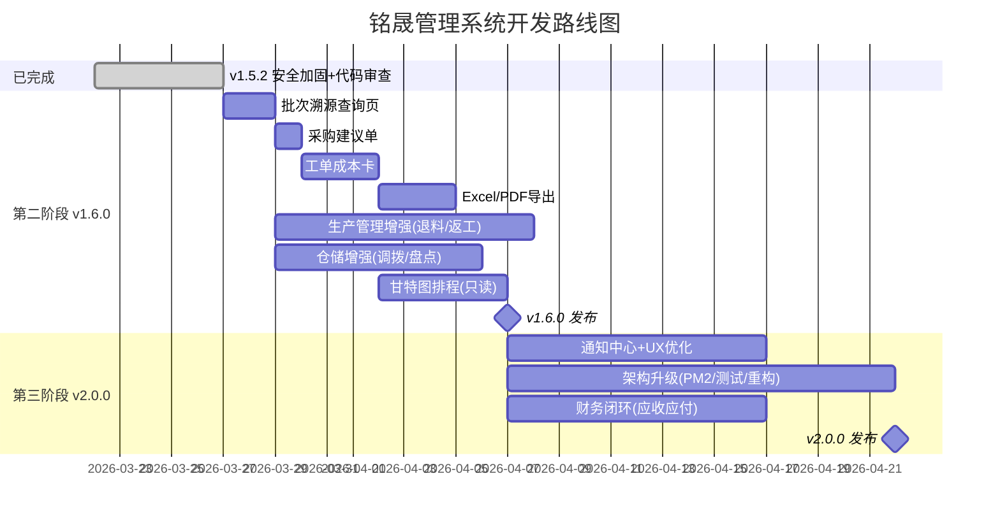

# 铭晟管理系统 — 后续开发计划排期

**当前版本**：v1.5.4（2026-03-26）  
**当前状态**：核心闭环完成，三轮代码审查通过，安全加固全部落地，confirm→Modal 替换完成

---

## 📋 状态图例

| 标记 | 含义 |
|---|---|
| ✅ | 已完成 |
| 🔧 | 部分完成 / 需深化 |
| ⏳ | 待开发 |
| 🚫 | 暂缓（复杂度过高） |

---

## 第一阶段：安全加固 ✅ → v1.5.2（已完成）

> 原计划 v1.4.1，实际在 v1.5.x 迭代中全部落地

| # | 任务 | 状态 | 说明 |
|---|------|---|---|
| 1.1 | 初始密码 bcrypt 加密 | ✅ | `bcryptjs` 已集成 |
| 1.2 | API 权限校验中间件 | ✅ | `requirePermission()` 全覆盖，粒度到 view/create/edit/delete |
| 1.3 | 操作日志启用 | ✅ | `writeLog()` 已在关键路由中调用 |
| 1.4 | paginate COUNT 优化 | ✅ | 子查询包装，`server.js:84` |
| 1.5 | 订单修改状态校验 | ✅ | 非 pending 禁止删除 |

---

## 第二阶段：功能增强（当前重点 → v1.6.0）

### 2A. 生产管理增强

| # | 任务 | 状态 | 预估 | 我的意见 |
|---|------|---|---|---|
| 2.1 | 生产退料 | ⏳ | 4h | 需在报工页面增加"退料"按钮，恢复库存 |
| 2.2 | 返工流程 | ⏳ | 6h | 质检不合格 → 重走指定工序。建议先做简易版（手动创建返工工单） |
| 2.3 | 工序间在制品追踪 | 🔧 | 4h | `production_process_records` 已有基础，需补 UI 展示 |
| 2.4 | **全链路批次溯源查询页** | ⏳ | 1~2天 | 🥇 **P0 推荐**。数据已全部就绪，只缺前端查询入口。演示震撼度最高 |
| 2.5 | 炉号/热处理批号字段 | ⏳ | 2h | `inbound_items` 扩展 `heat_no`，钢管行业常用 |
| 2.6 | 甘特图排程（只读） | ⏳ | 3~5天 | 建议先做只读展示，再迭代拖拽。推荐 `frappe-gantt` |
| 2.7 | **采购建议单自动生成** | ⏳ | 1天 | 🥈 **P1 推荐**。低于安全库存 → 自动推荐采购量+首选供应商 |

### 2B. 仓储管理增强

| # | 任务 | 状态 | 预估 | 我的意见 |
|---|------|---|---|---|
| 2.8 | 仓库间调拨 | ⏳ | 4h | 原材料/半成品跨仓转移 |
| 2.9 | 库存盘点 | ⏳ | 6h | 周期盘点 + 差异调整单 |
| 2.10 | 批次有效期管理 | ⏳ | 3h | 到期预警，适合化工/食品场景，钢管行业优先级低 |
| — | 库存预警 + 安全库存 | ✅ | — | `min_stock`/`max_stock` + Dashboard 预警卡片已实现 |
| — | 条码/二维码集成 | ✅ | — | `PrintableQRCode` + `ScanStation` 已实现 |

### 2C. 报表与导出

| # | 任务 | 状态 | 预估 | 我的意见 |
|---|------|---|---|---|
| 2.11 | Excel 导出 | ⏳ | 4h | 推荐 `xlsx` 或 `SheetJS`。库存/订单/生产报表 |
| 2.12 | 生产日报/月报 | ⏳ | 4h | 按日期汇总产量、不良率、物料消耗 |
| 2.13 | PDF 单据导出（固定模板） | ⏳ | 1~2天 | 推荐 `jspdf` + `html2canvas`。先固定模板，后期再做拖拽编辑器 |

### 2D. 财务核算

| # | 任务 | 状态 | 预估 | 我的意见 |
|---|------|---|---|---|
| 2.14 | **工单成本卡**（物料+委外） | ⏳ | 2~3天 | 🥉 **P1 推荐**。数据已有（领料 `unit_price` + 委外金额），只需汇总页面 |
| 2.15 | 利润分析 | ⏳ | 1天 | 依赖 2.14，单位成本 vs 销售单价 |
| 2.16 | 应收/应付账款 | ⏳ | 3~5天 | 采购→应付、销售→应收、付款勾销。建议在成本核算后做 |

---

## 第三阶段：体验与架构（→ v2.0.0）

### 3A. 用户体验

| # | 任务 | 状态 | 预估 | 我的意见 |
|---|------|---|---|---|
| 3.1 | 移动端适配 | ✅ | — | 全系统响应式已完成 |
| 3.2 | 消息通知中心 | ⏳ | 6h | 库存预警/质检异常/订单超期 → 站内通知 |
| 3.3 | 操作引导动画 | ⏳ | 3h | 新用户首次登录引导。优先级低 |
| 3.4 | `confirm()` → Modal | ✅ | — | 29 处替换完成，ConfirmModal 组件 + useConfirm Hook |
| 3.5 | 扫码工站 PDA 深度适配 | 🔧 | 4h | 基础已做，需根据车间实际反馈微调 |

### 3B. 架构升级

| # | 任务 | 状态 | 预估 | 我的意见 |
|---|------|---|---|---|
| 3.6 | PM2 进程管理 | ✅ | — | 已集成 deploy.ps1 + pm2 ecosystem |
| 3.7 | 自动化接口测试 | ⏳ | 8h | 核心联动链（报工→扣料→入库→出库）Vitest 测试 |
| 3.8 | 前端代码分割 | ✅ | — | 路由级 lazy loading 已实现（Vite 自动 code-split） |
| 3.9 | 数据库迁移评估 | ⏳ | 4h | SQLite → PostgreSQL，按数据量决策 |
| 3.10 | `outsourcing.js` God Function 拆分 | ✅ | — | 107行→4函数+25行调度 |
| 3.11 | TailwindCSS v3→v4 | ⏳ | 1~2天 | 无用户体验差异，纯 DX 提升 |
| 3.12 | Express v4→v5 | ⏳ | 1天 | 无用户体验差异，async 错误处理更好 |
| 3.13 | ESLint v9→v10 | ⏳ | 0.5天 | 无用户体验差异 |

---

## 暂缓项（复杂度过高，建议 v2.0+ 独立规划）

| 功能 | 原因 |
|---|---|
| 半成品中间入库 | 需新增工序间暂存仓概念，涉及仓库类型扩展 |
| 工时统计/打卡计时 | 需引入打卡/计时器组件，属独立模块 |
| 设备台账/工位管理 | 需新建 equipment 表，属固定资产范畴 |
| 微信小程序 / PWA | 可基于现有 API 低成本开发，但非紧急 |
| 可视化单据模板编辑器 | 拖拽式编辑器开发量大，先做固定模板 |

---

## 🎯 下一步推荐（Top 5 优先级）

| 排名 | 功能 | 预估 | 核心理由 |
|---|---|---|---|
| 🥇 | 全链路批次溯源查询页 | 1~2 天 | 数据全就绪，演示"Wow"最强 |
| 🥈 | 采购建议单自动生成 | 1 天 | 从被动找货到系统主动推货 |
| 🥉 | 工单成本卡 | 2~3 天 | 老板最在意的利润可视化 |
| 4 | Excel 导出 | 4h | 实用性高，财务/仓管刚需 |
| 5 | 只读甘特图排程 | 3~5 天 | 视觉冲击力强，生产主管最需要 |

---

## 版本路线图

