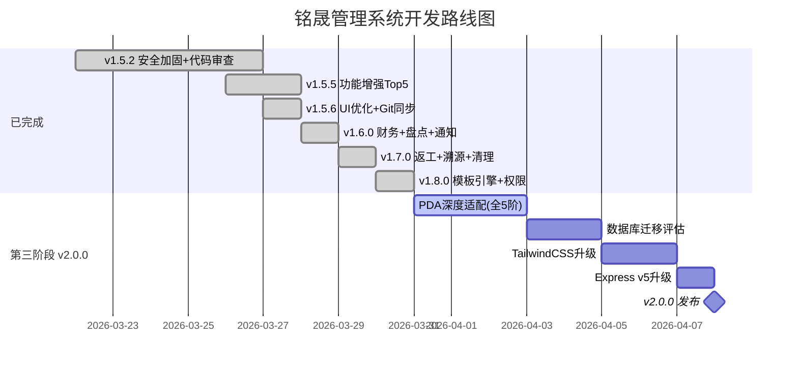

# 铭晟管理系统 — 后续开发计划排期

**当前版本**：v1.8.1（2026-03-31）  
**当前状态**：PDA H5 扫码工业级适配（阶段一已完成）✅

---

## 📋 状态图例

| 标记 | 含义 |
|---|---|
| ✅ | 已完成 |
| 🔧 | 部分完成 / 需深化 |
| ⏳ | 待开发 |
| ⏭️ | 跳过（业务不适用） |
| 🚫 | 暂缓（复杂度过高） |

---

## 第一阶段：安全加固 ✅ → v1.5.2（已完成）

> 原计划 v1.4.1，实际在 v1.5.x 迭代中全部落地

| # | 任务 | 状态 | 说明 |
|---|------|---|---|
| 1.1 | 初始密码 bcrypt 加密 | ✅ | `bcryptjs` 已集成 |
| 1.2 | API 权限校验中间件 | ✅ | `requirePermission()` 全覆盖，粒度到 view/create/edit/delete |
| 1.3 | 操作日志启用 | ✅ | `writeLog()` 已在关键路由中调用 |
| 1.4 | paginate COUNT 优化 | ✅ | 子查询包装，`server.js:84` |
| 1.5 | 订单修改状态校验 | ✅ | 非 pending 禁止删除 |

---

## 第二阶段：功能增强 ✅ → v1.7.0（全部收官）

### 2A. 生产管理增强

| # | 任务 | 状态 | 说明 |
|---|------|---|---|
| 2.1 | 生产退料 | ✅ | `pick.js` 支持 `type: 'return'`，前端有独立退料按钮 |
| 2.2 | 返工流程 | ✅ | `POST /production/:id/rework`，支持质检暂停与客户退回两种场景 |
| 2.3 | 工序间在制品追踪 | ✅ | 717 行追踪 API + `ProductionTrackingPanel` 前端面板 |
| 2.4 | **全链路批次溯源查询页** | ✅ | 6 表联查 + 时间线 + 4 Tab 明细 + Excel 导出 |
| 2.5 | 炉号/供应商批号字段扩展 | ✅ | `inbound_items` + `inventory` 新增 `heat_no`、`supplier_batch_no` |
| 2.6 | **甘特图排程（增强版）** | ✅ | 进度条 + Tooltip + 多状态颜色 + 周末高亮 |
| 2.7 | **采购建议单自动生成** | ✅ | 7 步聚合 + 紧急度 + 一键生成采购单 |

### 2B. 仓储管理增强

| # | 任务 | 状态 | 说明 |
|---|------|---|---|
| 2.8 | 仓库间调拨 | ✅ | 出库单 `target_warehouse_id` 跨仓转移 |
| 2.9 | 库存盘点 | ✅ | 盘点单 + 差异自动计算 + 手工补录盘盈物料 |
| 2.10 | 批次有效期管理 | ⏭️ | 钢管行业无保质期约束，不适用，跳过 |
| — | 库存预警 + 安全库存 | ✅ | `min_stock`/`max_stock` + Dashboard 预警卡片 |
| — | 条码/二维码集成 | ✅ | `PrintableQRCode` + `ScanStation` |

### 2C. 报表与导出

| # | 任务 | 状态 | 说明 |
|---|------|---|---|
| 2.11 | **Excel 导出** | ✅ | 通用 `export.js`（单表/多表/CSV） |
| 2.12 | 生产日报/月报 | ✅ | 独立 Dashboard 大屏面板 |
| 2.13 | PDF 单据导出 | ✅ | `exportToPDF` 前端通用导出 |

### 2D. 财务核算

| # | 任务 | 状态 | 说明 |
|---|------|---|---|
| 2.14 | **工单成本卡**（物料+委外） | ✅ | 汇总 + 明细弹窗 + 利润率 + Excel 导出 |
| 2.15 | 利润分析 | ✅ | 单位成本 vs 售价 + 利润率 |
| 2.16 | 应收/应付账款 | ✅ | 独立台账系统，勾销+付款记录 |

### 2E. 基础设施（v1.7.0 新增）

| # | 任务 | 状态 | 说明 |
|---|------|---|---|
| 2.17 | 遗留脚本清理 | ✅ | 删除 `fix_role_permissions.js`、`erp.db`、`mes.db.init` 等 4 个废弃文件 |
| 2.18 | `_bump.js` 升版工具增强 | ✅ | 覆盖 10 个文件，含 `frontend/public/VERSION`、`generate.bat` 等 |
| 2.19 | 版本号全局同步 | ✅ | 修复 3 处版本号脱节（`1.5.1` / `1.5.3` → `1.7.0`） |
| 2.20 | ConfirmModal React #130 修复 | ✅ | `useConfirm` Hook 返回组件格式修正 |

---

## 第三阶段：体验与架构（→ v2.0.0）

### 3A. 用户体验

| # | 任务 | 状态 | 预估 | 说明 |
|---|------|---|---|---|
| 3.1 | 移动端适配 | ✅ | — | 全系统响应式已完成 |
| 3.2 | 消息通知中心 | ✅ | — | 库存预警/质检异常 → 站内通知（已实现 NotificationBell） |
| 3.3 | 操作引导动画 | ⏳ | 3h | 新用户首次登录引导。优先级低 |
| 3.4 | `confirm()` → Modal | ✅ | — | 全部替换完成 |
| 3.5 | 登录错误提示 | ✅ | — | 401 响应正确显示错误信息 |
| 3.6 | 扫码工站 PDA 深度适配 | 🔧 | 3h | 第一阶段（打通 H5 钩子无焦点模式）已完成。后续 4 个阶段详见 pda_upgrade_plan.md |
| 3.7 | UI 视觉优化 | ✅ | — | 表格/侧边栏/空状态/焦点等全面优化 |

### 3B. 架构升级

| # | 任务 | 状态 | 预估 | 说明 |
|---|------|---|---|---|
| 3.8 | PM2 进程管理 | ✅ | — | PM2 + 自动提权同步脚本 |
| 3.9 | **自动化测试** | ✅ | — | 6 文件 92 tests |
| 3.10 | 前端代码分割 | ✅ | — | 路由级 lazy loading |
| 3.11 | Git 同步工作流 | ✅ | — | `server-sync.ps1` 一键同步 |
| 3.12 | 数据库迁移评估 | ⏳ | 4h | SQLite → PostgreSQL，按数据量决策 |
| 3.13 | `outsourcing.js` 拆分 | ✅ | — | 107行→4函数+25行调度 |
| 3.14 | TailwindCSS v3→v4 | ⏳ | 1~2天 | 纯 DX 提升 |
| 3.15 | Express v4→v5 | ⏳ | 1天 | async 错误处理更好 |

---

## 暂缓项（复杂度过高，建议 v2.0+ 独立规划）

| 功能 | 原因 |
|---|---|
| 工时统计/打卡计时 | 需引入打卡/计时器组件，属独立模块 |
| 设备台账/工位管理 | 需新建 equipment 表，属固定资产范畴 |
| 微信小程序 / PWA | 可基于现有 API 低成本开发，但非紧急 |
| 可视化单据模板编辑器 | 拖拽式编辑器开发量大 |

---

## 🎯 下一步推荐（第三阶段待办）

| 排名 | 功能 | 预估 | 核心理由 |
|---|---|---|---|
| 🥇 | **PDA 扫码深度适配 (阶段二)** | 4h | 实现连扫+1 引擎与大尺寸数字键盘 |
| 🥈 | 工位展示屏深化（WebSocket 推送） | 5h | 直接提升车间作业可视化 |
| 🥉 | 实机打印样式调优 | 3h | 根据实际打印机微调 CSS |
| 4 | 恢复默认模板功能 | 1h | 防止误删预置模板 |
| 5 | 数据库迁移评估(PG) | 4h | 数据量增长后的性能瓶颈预防 |

---

## 版本路线图

