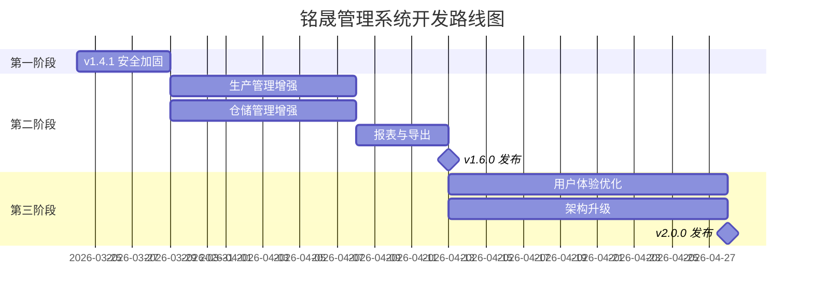

# 铭晟管理系统 — 后续开发计划排期

**基准版本**：v1.4.0（2026-03-23）  
**当前状态**：核心业务闭环已完成，全链路BUG已修复，系统评估综合 77 分

---

## 第一阶段：加固与补全（1 周内）

> 目标：消除已知风险，让系统安心投产

| # | 任务 | 优先级 | 预估工时 | 涉及文件 |
|---|------|--------|---------|---------|
| 1.1 | **初始密码 bcrypt 加密** — insertInitialData 中默认用户密码改为 bcrypt 哈希 | 🔴 高 | 0.5h | database.js |
| 1.2 | **API 权限校验中间件** — 基于 req.user.role 和 role_permissions 表做路由级权限控制 | 🔴 高 | 3h | server.js, 新建 middleware/auth.js |
| 1.3 | **操作日志启用** — 在关键增删改接口中写入 operation_logs 表 | 🟠 中 | 2h | 各路由文件 |
| 1.4 | **paginate COUNT 优化** — 改为子查询包装避免正则剥离 ORDER BY 出错 | 🟡 低 | 0.5h | server.js |
| 1.5 | **订单修改状态校验** — 非 pending 状态禁止编辑 | 🟡 低 | 0.5h | orders.js |

**里程碑**：v1.4.1 安全加固版

---

## 第二阶段：功能增强（2-4 周）

> 目标：补全业务短板，提升操作效率

### 2A. 生产管理增强

| # | 任务 | 说明 | 预估工时 |
|---|------|------|---------|
| 2.1 | **生产退料** | 工序报工扣减后支持退回原材料，恢复库存 | 4h |
| 2.2 | **返工流程** | 质检不合格时可发起返工，重走指定工序 | 6h |
| 2.3 | **工序间在制品追踪** | 记录半成品在各工序间的流转状态 | 4h |

### 2B. 仓储管理增强

| # | 任务 | 说明 | 预估工时 |
|---|------|------|---------|
| 2.4 | **仓库间调拨** | 支持原材料/半成品在不同仓库间转移 | 4h |
| 2.5 | **库存盘点** | 支持周期盘点，差异自动生成调整单 | 6h |
| 2.6 | **批次有效期管理** | 为批次增加生产日期和有效期字段，到期预警 | 3h |

### 2C. 报表与导出

| # | 任务 | 说明 | 预估工时 |
|---|------|------|---------|
| 2.7 | **Excel 导出** | 库存表、订单表、生产报表导出为 .xlsx | 4h |
| 2.8 | **生产日报/月报** | 按日期汇总工序产量、不良率、物料消耗 | 4h |

**里程碑**：v1.6.0 功能增强版

---

## 第三阶段：体验与架构（1-3 个月）

> 目标：提升用户体验和系统稳健性

### 3A. 用户体验

| # | 任务 | 说明 | 预估工时 |
|---|------|------|---------|
| 3.1 | **移动端适配** | 关键页面（报工、扫码、库存查询）响应式布局 | 8h |
| 3.2 | **消息通知中心** | 库存预警、质检异常、订单超期自动推送站内通知 | 6h |
| 3.3 | **操作引导** | 新用户首次登录时显示功能引导动画 | 3h |

### 3B. 架构升级

| # | 任务 | 说明 | 预估工时 |
|---|------|------|---------|
| 3.4 | **PM2 进程管理** | 替代裸 node 启动，支持自动重启和集群模式 | 2h |
| 3.5 | **自动化接口测试** | 为核心联动（报工→扣料→入库→出库）编写 Jest 测试 | 8h |
| 3.6 | **前端代码分割** | 路由级 lazy loading，减小首屏体积 | 3h |
| 3.7 | **数据库迁移准备** | 当数据量超预期时，评估迁移至 PostgreSQL 的方案 | 4h |

**里程碑**：v2.0.0 企业稳定版

---

## 版本路线图总览



---

## 各阶段依赖关系

```
v1.4.0（当前）
  │
  ├─► v1.4.1 安全加固（1周）── 必须先做，消除安全隐患
  │
  ├─► v1.6.0 功能增强（2-4周）── 可并行开发
  │     ├── 退料/返工 ← 依赖现有报工逻辑
  │     ├── 调拨/盘点 ← 依赖批次库存模型
  │     └── 报表导出 ← 无强依赖
  │
  └─► v2.0.0 企业版（1-3月）── 按需推进
        ├── 移动端 ← 需前端重构
        ├── 测试 ← 需所有功能稳定后
        └── 数据库迁移 ← 按数据量决策
```

> **建议**：第一阶段的 1.1（初始密码加密）和 1.2（权限校验）是安全底线，建议在系统正式启用前完成。第二阶段可根据业务紧迫程度灵活排列优先级。
